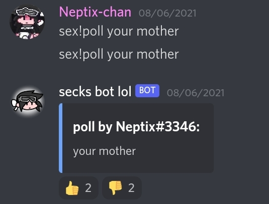
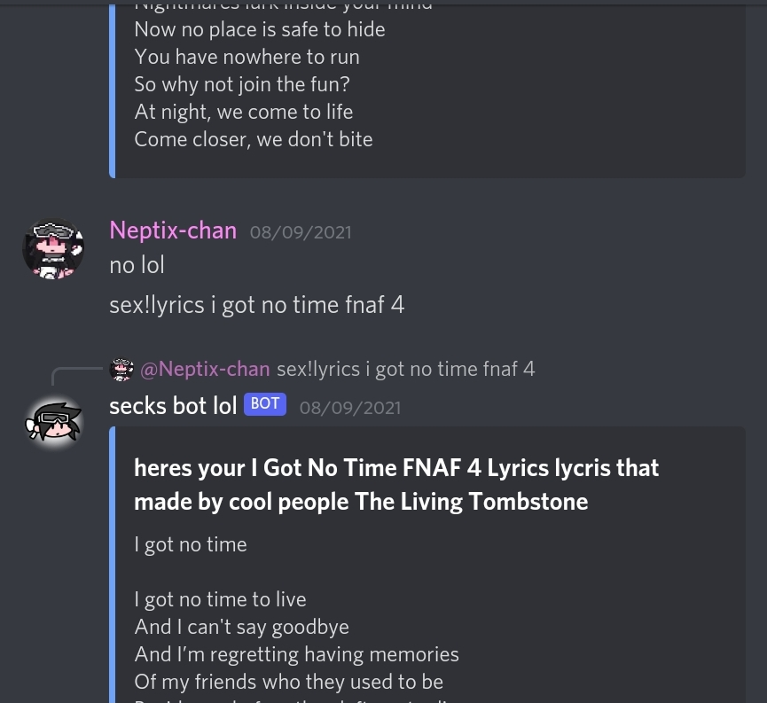
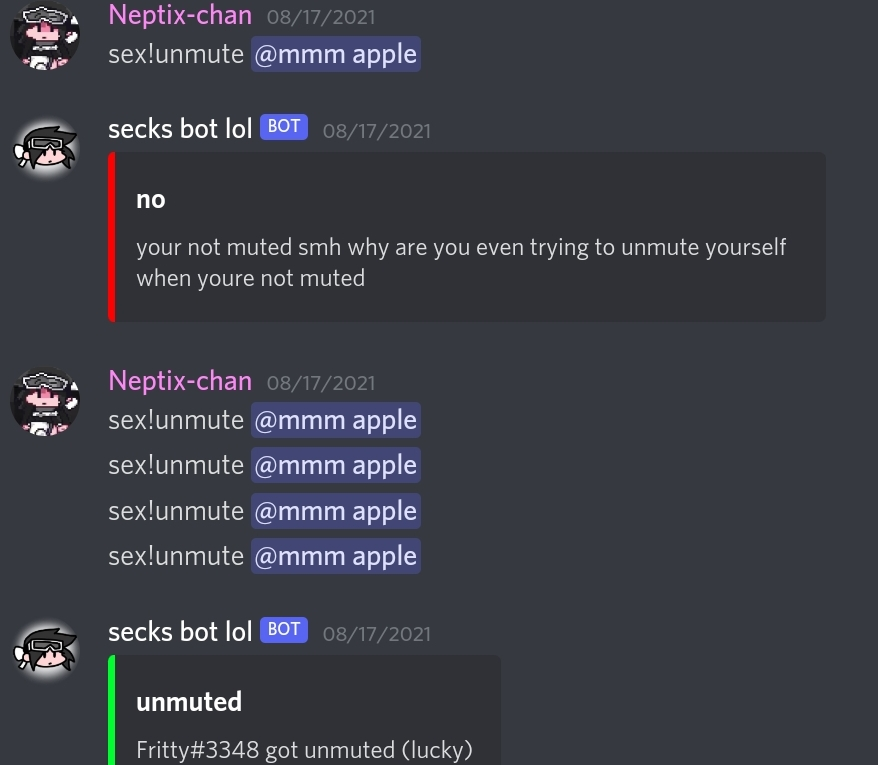

# SECKS BOT OFFICIAL
---
## SECKS BOT OPEN SOURCE
- **Secks Bot** is made by [Neptix](https://youtube.com/channel/UCPikKVovLygt86ohjIuR0WQ).

- Coded in Python (discord.py) with love and unfunny humors.

---

  
  

---
# HOW TO USE/MODIFY

**Notes**
- You must have a good (intermediate) coding (specifically: Python) skills. It is important for you to modify and add stuff to.
- You must have a device that that compatible with Python (can run Python). Such as PC, Laptop or something. (Online IDE's that support discord.py library, Visual Studio Code/Community.
- Have discord.py library installed/imported.
- You must credit me because yeah I made this thingy (seriously)

---
## 1. Install/Import Python and needed libraries.
- Because I don't have a PC so I can't give out screenshot. I'm just gonna list down:
discord, os, JSON, aiohttp, dotenv, asyncio. (install these with PIP).
- The others I already imported in the file.

## 2. Download code.
- Self-explanatory. Install the source code in Releases or Code section on this repo.

## 3. Do stuff
- Yeah now you can do anything you want with the code now.
- You can modify, use, contribute,... stuff.

---
# IMPORTANT
- Please, do not use (a harder word: steal) this and use for your ownself (such as selling or stuff, yknow, about money).

---
# Have fun!

lol
